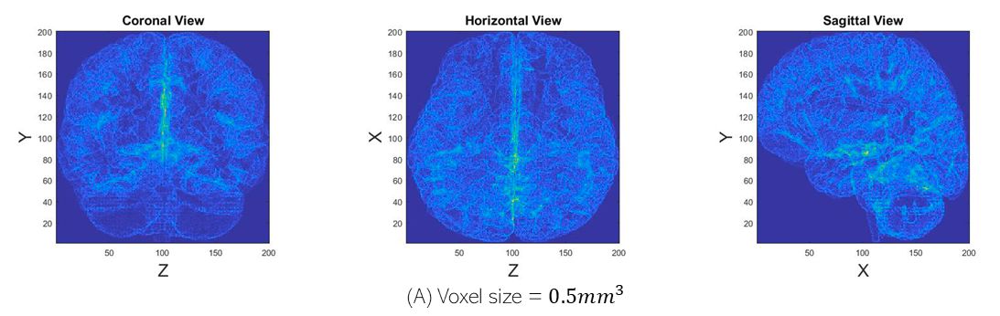

# 🧠 rs-fMRI Brain Scan Analyser

A MATLAB toolkit to **simulate resting-state fMRI scans** and **detect Cortical Spreading Depression (CSD)** — a phenomenon associated with migraines and unusual neural activity.

## 🔬 What It Does

- 📈 **Simulate Synthetic fMRI Scans**  
  Create custom 3D fMRI voxel maps that mimic BOLD signal propagation across brain regions like V3A to V5. Simulates waves of activation with noise and customizable intensity.

- 🧭 **Detect Neural Activity Waves (CSD)**  
  Analyse `.nii` fMRI scans using a custom-built algorithm. The system plants "buoys" in voxel space and moves them based on gradient direction, flagging patterns that resemble CSD.

## ⚙️ How It Works

- Uses **trilinear interpolation** and **gradient descent** to move spatial markers through 3D brain volumes
- Tracks marker displacement across timepoints to identify consistent signal propagation
- Validated on synthetic data, and designed to be extendable to real-world scans

## 📦 File Types

- Supports `.nii` NIfTI files (standard format for fMRI scans)
- Outputs visual plots of voxel activity, gradient maps, and marker movement

## 🛠 Built With

`MATLAB` · `interp3` · `voxel mapping` · `gradient tracking` · `trilinear interpolation`

## 📁 Example Use Case

Want to know if a rare CSD episode was buried in a public fMRI dataset? Use the detector to scan voxel data for subtle signal waves, or generate test data for your own models.

## 📷 Preview

---

> Developed as part of my undergraduate thesis (Grade: 73%).  
> Always open to collaboration or porting ideas into Python or other formats.

📫 [Contact](mailto:theojenkins51@gmail.com)
